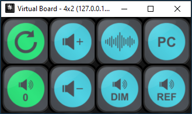

# Trinnov Nova StreamDeck Controller



The **Trinnov Nova StreamDeck Controller** is a tool designed to enhance your interaction with the Trinnov Nova by enabling streamlined control via a StreamDeck device.

It communicates directly with the Nova unit using WebSockets and binary messages, ensuring seamless synchronization and real-time command execution. The controller also features a user-friendly visualization system powered by the [**VirtualBoard**](https://github.com/OpenMacroBoard/OpenMacroBoard.SDK/tree/master/src/OpenMacroBoard.VirtualBoard) from [**OpenMacroBoard.SDK**](https://github.com/OpenMacroBoard/OpenMacroBoard.SDK), in case you don't have a StreamDeck.

---

## Features

- **WebSocket Communication**: Uses WebSocket connections for reliable and efficient communication between the controller and the Nova unit.
- **Binary Messaging**: Supports binary commands to interact with the Nova for precise control and feedback.
- **Real-Time Synchronization**: Automatically keeps the StreamDeck in sync with the Nova unit's current state.
- **Customizable IP Address**: The WebSocket IP address for connecting to the Nova can be updated directly in the source code.
- **Visual Feedback**: Leverages the [**VirtualBoard**](https://github.com/OpenMacroBoard/OpenMacroBoard.SDK/tree/master/src/OpenMacroBoard.VirtualBoard) from [**OpenMacroBoard.SDK**](https://github.com/OpenMacroBoard/OpenMacroBoard.SDK) to provide dynamic and interactive feedback without a StreamDeck.

---

## Requirements

- .NET 8.0 runtime
- A StreamDeck device (optional)
- Access to the Nova unit via WebSocket

---

## Setup and Installation

1. Clone this repository:
   ```bash
   git clone https://github.com/codebrain/trinnov-stream-deck.git
   cd trinnov-stream-deck

2. Modify the IP address of the Nova: https://github.com/codebrain/trinnov-stream-deck/blob/e458720cce3b13f901d5fd1aa4d33a44d399a8ec/Program.cs#L19

3. `dotnet run`
